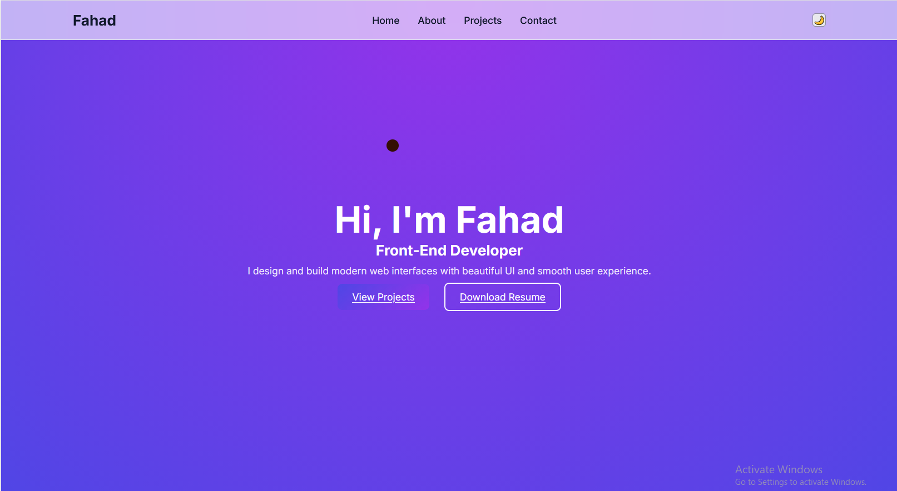

# 💼 Portfolio Website

A modern and responsive **Personal Portfolio Website** designed to showcase my skills, projects, and experience as a front-end developer. The website includes multiple sections such as Home, About, Projects, and Contact to present my work professionally. This project is built using **HTML, CSS, and JavaScript**.

---

🔗 **Live Demo:** https://DevByFahad.github.io/Portfolio-Website/

---

## 📌 Features

* 🎨 Modern and professional UI design
* 📱 Fully responsive layout
* ⚡ Smooth scrolling navigation
* 🧭 Multiple sections (Home, About, Projects, Contact)
* 🚀 Fast and lightweight
* 🎯 Built with vanilla JavaScript

---

## 🛠 Technologies Used

* HTML
* CSS
* JavaScript

---

## 🚀 How to Run the Project

1. Clone the repository

```id="83lq2e"
git clone https://github.com/DevByFahad/portfolio-website.git
```

2. Navigate to the project folder

```id="sow6c8"
cd portfolio-website
```

3. Open the `index.html` file in your browser.

---

## 📂 Project Structure

```id="f12g7o"
portfolio-website
│
├── index.html
├── style.css
├── script.js
└── README.md
```

---

## 🎯 Purpose of the Project

This project was created to practice and demonstrate front-end development skills such as:

* Building a professional developer portfolio
* Creating responsive layouts
* Showcasing projects and skills
* Improving UI/UX design

---

## 👨‍💻 Author

**Muhammad Fahad**

---

## ⭐ Show Your Support

If you like this project, consider giving it a **star** on GitHub!

---

## 📸 Portfolio Website

Here’s what it looks like 👇


